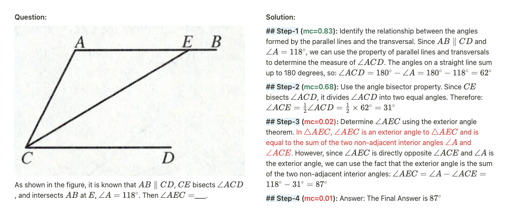

<div align="center">
    
</div>

<div align="center">

# MM-PRM

</div>

<div align="center">
<p align="center">
  📖<a href="https://adaptive-paddleboat-4fd.notion.site/MM-PRM-1c0c99bc2f2b80978eb5ec22e131fba1">Blog</a> |
  🤗<a href="https://huggingface.co/Cierra0506/MM-PRM-8B">MM-PRM-8B</a>
</p>
</div>

<hr>
<div align="center">
<p style="text-align: center;">MM-PRM: An open implementation of OmegaPRM and its corresponding training pipeline<p>
</div>
<hr>

## 🎯Overview

Multimodal Large Language Models (MLLMs) have shown promising performance on various reasoning tasks, yet their ability to reliably solve complex multi-step problems remains limited. Process Reward Models (PRMs) address this challenge by explicitly evaluating the correctness of each intermediate reasoning step, guiding models toward more robust solutions. However, effectively training PRMs typically requires substantial amounts of step-level supervision data, which are expensive and challenging to obtain.

We provide a complete implementation of **OmegaPRM**, an automated Monte Carlo Tree Search-based data pipeline, to generate scalable and high-quality multimodal step-level supervision data along with its corresponding training pipeline. Using this pipeline, we introduce a multimodal PRM based on the InternVL series.

We open-source our complete pipeline to foster further research in this area. We release all our codes, models, etc. at [MM-PRM](https://github.com/ModalMinds/MM-PRM).

## 🗞️ News

- **\[2025/03/25\]** We released `MM-PRM`.
  - 📖 Blog: [MM-PRM-Blog](https://adaptive-paddleboat-4fd.notion.site/MM-PRM-1c0c99bc2f2b80978eb5ec22e131fba1)
  - 🤗 Model: [MM-PRM-8B](https://huggingface.co/Cierra0506/MM-PRM-8B)

## 🤖 Models

<div align="center">
    
</div>

*Figure 1 | A case study showcasing the output of MM-PRM-8B. The PRM assigns confidence scores to each reasoning step and successfully distinguishes correct steps from incorrect ones.*

|                   | Random (baseline) | min         | last        | average                                    | max         | sum_log prob                               | sum_logits                                 | mean_odd    |
| ----------------- | ----------------- | ----------- | ----------- | ------------------------------------------ | ----------- | ------------------------------------------ | ------------------------------------------ | ----------- |
| **K12**           | 36.2              | 43.8 (+7.6) | 41.8 (+5.6) | <span style="color:red">44.0 (+7.8)</span> | 42.2 (+6.0) | <span style="color:red">44.0 (+7.8)</span> | 43.8 (+7.6)                                | 42.4 (+6.2) |
| **OlympiadBench** | 15.0              | 19.3 (+4.3) | 18.0 (+3.0) | 19.3 (+4.3)                                | 18.7 (+3.7) | 18.7 (+3.7)                                | <span style="color:red">20.7 (+5.7)</span> | 18.7 (+3.7) |

*Table 1 | Evaluation results of MM-PRM-8B under Best-of-N (BoN, 16 rollout) metrics. K12 represents in-domain setting, while OlympiadBench serves as an out-of-domain benchmark. Our PRM consistently improves over the random baseline across multiple aggregation strategies.*

- 🤗 [MM-PRM-8B](https://huggingface.co/Cierra0506/MM-PRM-8B)

## 🏁 Getting Started

### 📦 Installation

```shell
git clone https://github.com/ModalMinds/MM-PRM.git
cd MM-PRM
pip install -r requirements.txt

# install flash-attn==2.3.6:

pip install flash-attn==2.3.6 --no-build-isolation

# Alternatively you can compile from source:

git clone https://github.com/Dao-AILab/flash-attention.git
cd flash-attention
git checkout v2.3.6
python setup.py install
```

### 📂 OmegaPRM Data Pipeline

1. **Seed dataset preparation**

   To begin, prepare a seed dataset consisting of verifiable problems. Each example should be formatted as a JSON object containing the following fields:

   ```json
   [
       {
           "id": "unique identifier for the problem",
           "question": "problem statement",
           "correct_answer": "ground-truth final answer for evaluation and verification",
           "image_path": "/path/to/image.png"
       },
       ...
   ]
   ```

   This dataset will be used as input to the OmegaPRM engine to generate annotated solution trees with step-wise correctness labels.

   To enable parallel data generation, you need to split the seed dataset into smaller chunks.

   ```shell
   cd data_pipeline
   python process_json.py
   ```

2. **API endpoint setup (Optional)**

   The OmegaPRM data generation process requires an API endpoint to automatically verify whether the final answer in a rollout is correct. You can deploy a model (e.g., Qwen2.5) locally to act as the answer judge.

   We recommend using [vLLM](https://docs.vllm.ai/) to deploy a local model.

3. **Run OmegaPRM**

   Once you have all set, you can run the OmegaPRM pipeline to generate step-level supervision data.

   Before running, ensure that all necessary parameters are correctly set in the script or passed through the environment.

   ```shell
   sh run_omegaprm.sh
   ```

4. **Sampling Training Data from OmegaPRM annotation trees**

   After generating annotated reasoning trees with OmegaPRM, you need to sample step-by-step solution paths from these trees to construct the training data for the Process Reward Model (PRM). This can be done using the script:

   ```shell
   python traverse.py
   ```

   The next step is to convert this data into the format required for PRM training. Use the following script to perform the formatting:

   ```shell
   python prm_data_format.py
   ```

### 🌐 Start PRM Training

Create a JSON file in `internvl_chat/shell/data/`

The format for the JSON file should be:

```json
{
  "your-custom-prm_dataset": {
    "root": "/path/to/the/image/root",
    "annotation": "/path/to/the/jsonl/annotation",
    "data_augment": false,
    "repeat_time": 1,
    "length": "number of samples in the dataset"
  }
}
```

Once the dataset configuration is in place, you can start training the PRM model with:

```shell
GPUS=8 sh shell/internvl2.5/2nd_finetune/internvl2_5_38b_dynamic_res_2nd_finetune_full_prm.sh
```

### 📊 Evaluation

We provide our **evaluation code** in the `eval/` directory.

## ⭐ Starchart

[](https://star-history.com/#ModalMinds/MM-PRM&Date)

## 🤝 Contribution

If you want to contribute, please feel free to make a pull request or create an issue.

Please refer to `CONTRIBUTING.md` before you dive in！

## 📬 Contact

If you have any questions or would like to engage with our community, feel free to scan the QR code below to join our WeChat group.

<div align="center">

</div>

## 🎓 Acknowledgements

We acknowledge the outstanding open-source contributions from [OpenR](https://github.com/openreasoner/openr) and [vLLM](https://github.com/vllm-project/vllm). We also extend our gratitude to [InternVL](https://github.com/OpenGVLab/InternVL) for their open-source techniques and base models, which have enabled us to further our exploration.

## 📜 Citation

```
@misc{MM-PRM2025,
  title={MM-PRM: An open implementation of OmegaPRM and its corresponding training pipeline},
  author={ModalMinds Team},
  year={2025},
  howpublished={\url{https://github.com/ModalMinds/MM-PRM}},
}
```
